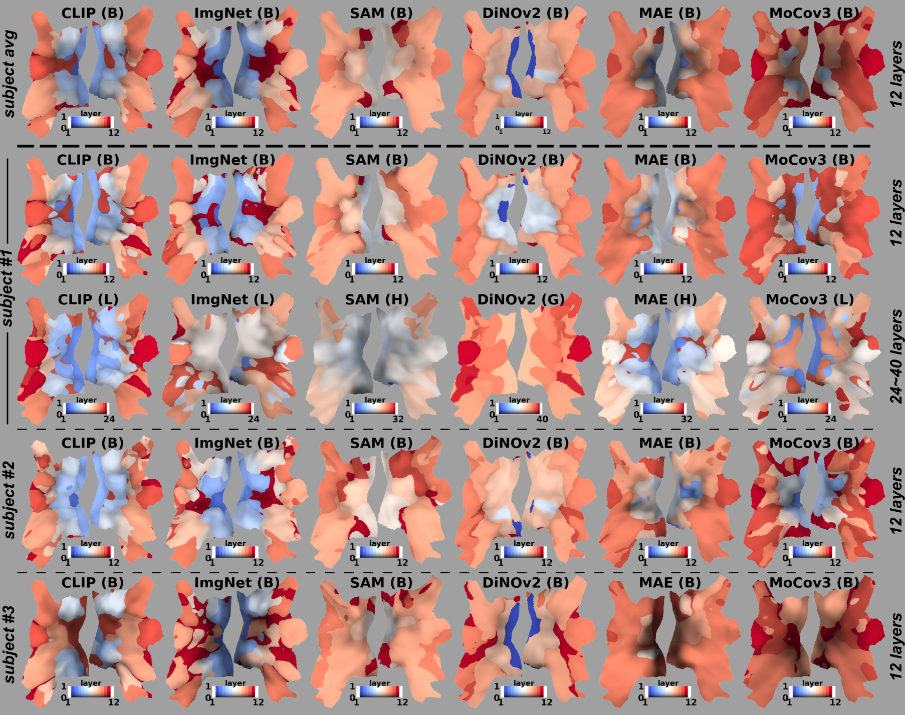
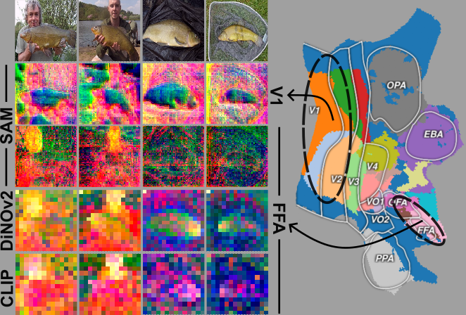

## Brain Decodes Deep Nets <br><sub> PyTorch Implementation</sub>


### [📄Paper](http://arxiv.org/abs/TODO) | [🌐Website](https://huzeyann.github.io/brain-decodes-deep-nets)


> [**Brain Decodes Deep Nets**](http://arxiv.org/abs/TODO)<br>
> [Huzheng Yang](https://huzeyann.github.io/), [James Gee*](https://www.med.upenn.edu/apps/faculty/index.php/g5455356/p10656), [Jianbo Shi*](https://www.cis.upenn.edu/~jshi/)
> <br>University of Pennsylvania<br>

<!-- <details>
<summary>▶️Video</summary>
<iframe width="1932" height="881" src="https://www.youtube.com/embed/WX7V2O6SnN4" title="Brain Decodes Deep Nets" frameborder="0" allow="accelerometer; autoplay; clipboard-write; encrypted-media; gyroscope; picture-in-picture; web-share" allowfullscreen></iframe>
</details> -->


We developed a tool for visualizing and analyzing large pre-trained vision models by mapping them onto the brain, thus exposing the model's hidden inside. Our innovation arises from **brain encoding model**: predicting brain fMRI measurements in response to images.

**Brain encoding model** in a nut shell: 
1. extract features from pre-trained deep nets
2. feature selection for each brain voxel
3. linear regression to predict each brain voxel

The brain visualization come from feature selection, each brain voxel asks the question: "which network **layer/space/scale/channel** best predicts my brain response?".

Our visualization shows how different training methods matter: they lead to remarkable differences in hierarchical organization and scaling behavior, growing with more data or model size.

> Our API ([example.ipynb](example.ipynb)) is plug-in and play for most image backbone models, it only take 30 min to run.





---
This repository contains:

* 😎 PyTorch [implementation](brainnet/model.py) of the brain encoding model
* 🎸 PyTorch Lightning [training script](brainnet/plmodel.py)
* 🥁 custom [visualization](brainnet/plot_utils.py) and plotting code
* 😇 [example.ipynb](example.ipynb) only requires **30 min** on RTX4090 to visualize a model.


## Data preparation
### Algonauts 2023
We do not have the right to redistribute the dataset. Please manually download and unzip subj01.zip (4GB) from the [algonauts 2023 challenge](http://algonauts.csail.mit.edu/), please fill in [this form](https://docs.google.com/forms/d/e/1FAIpQLSehZkqZOUNk18uTjRTuLj7UYmRGz-OkdsU25AyO3Wm6iAb0VA/viewform
) to get the download link.

The provided dataset implementation expect the following contents:
```
<ROOT>/training_split
<ROOT>/training_split/training_fmri
<ROOT>/training_split/training_images
```

The dataset can be loaded with the following Python code:
```python
from brainnet.dataset import BrainDataset

ROOT = "/data/download/alg23/subj01"
dataset = BrainDataset(ROOT)
img, fmri = dataset[0]
```


## Installation
The brian encoding model training requires PyTorch 2.0, pytorch-lightning and torchmetrics. The implemented pre-trained models requires dinov2, open_clip, timm, segment_anything. To setup all the required dependencies for brain encoding model and pre-trained models, please follow the instructions below:

*[conda](https://docs.conda.io/projects/conda/en/latest/user-guide/getting-started.html)*  - Clone the repository and then create and activate a `brainnet` conda environment using the provided environment definition:

```shell
conda env create -f environment.yaml
conda activate brainnet
```

*[docker](https://docs.docker.com/get-docker/)* - Pull from docker hub, the docker image (15G) contain all the packages.

```shell
docker pull huzeeee/afo:latest
```

## Brain-to-Network Mapping
The brain-to-network mapping is a by-product of brain encoding model, [plmodel.py](brainnet/plmodel.py) is a pytorch lightning implementation of the training code. The following code is a minimal example to run the training:

```python
from brainnet.plmodel import PLModel
from brainnet.config import get_cfg_defaults
from brainnet.backbone import ModifiedCLIP
import pytorch_lightning as pl

cfg = get_cfg_defaults()
cfg.DATASET.DATA_DIR = '/data/huze/download/alg23/subj01'

backbone = ModifiedCLIP()
plmodel = PLModel(cfg, backbone)

trainer = pl.Trainer()
trainer.fit(plmodel)

```

We **strongly recommend** to check out the complete training and visualization example in [example.ipynb](example.ipynb), running this notebook only requires 30 min on RTX4090.


## API for analyzing your model
We have implemented 6 models in `brainnet.backbone`, the backbones are supported to be plug-in and play in the brain encoding model. To plug-in your model, you need to implement a `model.get_tokens()` method as the following code block. During training, the brain encoding model (in `plmodel.forward`) will call this `get_tokens()` to get the local and global tokens from your pre-trained model.

A complete API example is in [example.ipynb](example.ipynb)
```python
class ModifiedDiNOv2(nn.Module):
    def __init__(self, ver="dinov2_vitb14", **kwargs) -> None:
        super().__init__()
        self.vision_model = torch.hub.load("facebookresearch/dinov2", ver)

    """
    get_tokens() need to be implemented by user.
    """
    def get_tokens(self, x):
        x = self.vision_model.prepare_tokens_with_masks(x)

        local_tokens = {}
        global_tokens = {}
        for i, blk in enumerate(self.vision_model.blocks):
            x = blk(x)
            saved_x = x.clone()
            global_tokens[str(i)] = saved_x[:, 0, :]  # [B, C]
            saved_x = saved_x[:, 1:, :]  # remove cls token, [B, N, C]
            p = int(np.sqrt(saved_x.shape[1]))
            saved_x = rearrange(saved_x, "b (p1 p2) c -> b c p1 p2", p1=p, p2=p)
            local_tokens[str(i)] = saved_x
        
        """
        return:
        local_tokens: dict, key: str, value: [B, C, H, W]
        global_tokens: dict, key: str, value: [B, C]
        """
        return local_tokens, global_tokens

```

### Automatic caching
Caching offer speed up by trading memory consumption. `PLModel(cached=True)` will enable automatic caching of local_tokans and global_tokens returned by the image backbone model. The tokens will be computed only once and stay in the RAM (not VRAM), a 12-layer 768-dim model takes ~20G of RAM for caching. No cache will stored to the hard disk, cache will be deleted after running.

---

## License
The code and model weights are licensed under CC-BY-NC. See [`LICENSE.txt`](LICENSE.txt) for details.

## BibTeX

```bibtex
@article{TODO,
  title={Brain Decodes Deep Nets},
  author={Yang, Huzheng and Gee, James and Shi, Jianbo},
  year={2023},
  journal={arXiv preprint arXiv:TODO},
}
```